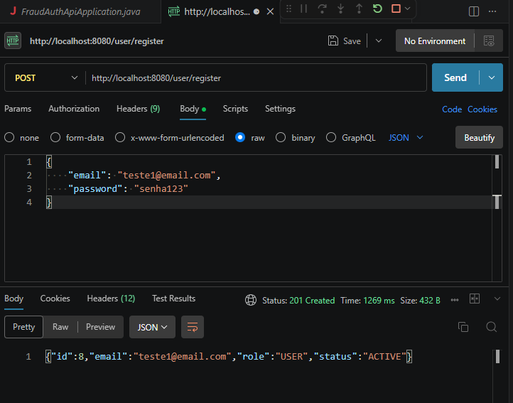
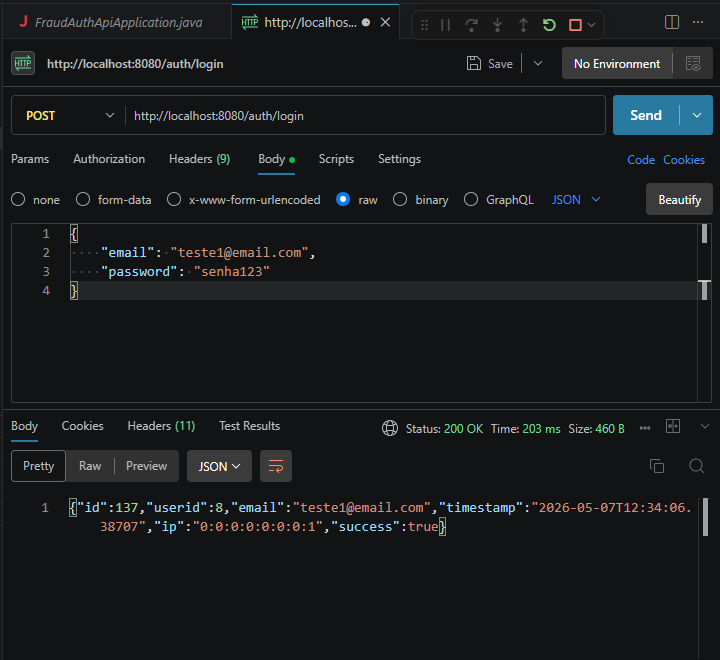
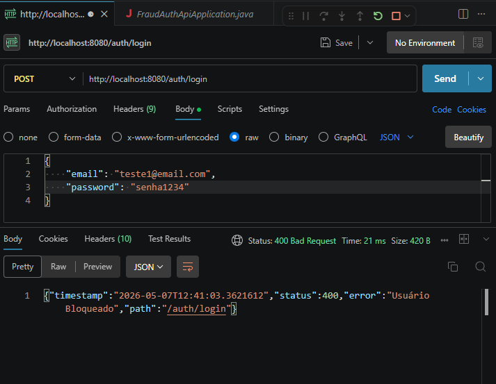
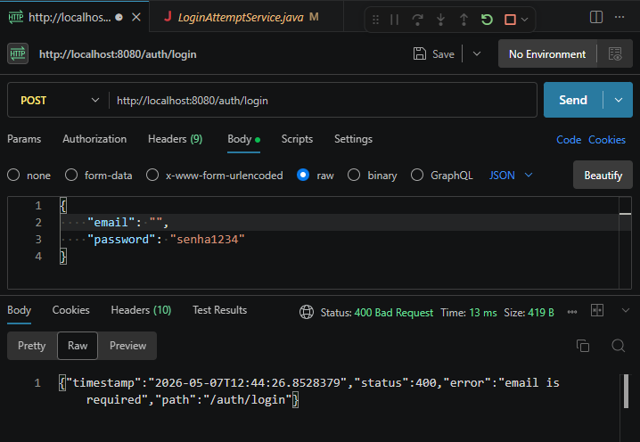
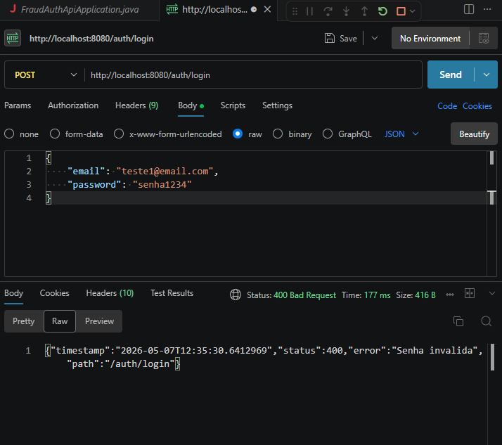

# Fraud Auth API

A secure authentication API built with Spring Boot focused on fraud prevention, login protection, and secure authentication flows.

---

## Features

* User registration and authentication
* BCrypt password encryption
* Login attempt tracking
* Automatic user blocking after multiple failed attempts
* Suspicious IP detection
* DTO validation
* Global exception handling
* Layered architecture (Controller, Service, Repository, DTO)
* PostgreSQL integration
* RESTful API design

---

## Technologies

* Java 21
* Spring Boot
* Spring Security
* Spring Data JPA
* PostgreSQL
* Lombok
* Maven
* BCrypt

---

## Project Structure

```bash
src/main/java/com/fraud_auth_api
├── controller
├── dto
├── entity
├── enums
├── exception
├── repository
├── security
└── services
```

---

## Fraud Prevention Logic

The API includes protection mechanisms against suspicious authentication behavior.

### Implemented Rules

* User is blocked after 5 failed login attempts
* Login attempts are tracked with:

  * IP address
  * timestamp
  * success/failure status
* Suspicious IP behavior detection
* User status control:

  * ACTIVE
  * BLOCKED
  * UNDER_REVIEW

---

## API Responses

### Successfull Register



---

### Successful Login



---

### User Blocked



---

### Validation Error



---

### Attempt Error



---

## Exception Handling

The project uses a global exception handler with standardized API responses.

Example:

```json
{
  "timestamp": "2026-05-07T12:44:26",
  "status": 400,
  "error": "email is required",
  "path": "/auth/login"
}
```

---

## Authentication Flow

1. User sends login credentials
2. Password is validated using BCrypt
3. Login attempt is registered
4. Fraud validation rules are applied
5. API returns authentication response

---

## Future Improvements

* JWT authentication
* Role-based authorization
* Refresh token support
* Rate limiting
* Docker support
* Unit and integration tests
* API documentation with Swagger

---

## Running the Project

### Clone repository

```bash
git clone https://github.com/josemariadev12/fraud-auth-api.git
```

### Configure PostgreSQL

Update your `application.properties`:

```properties
spring.datasource.url=jdbc:postgresql://localhost:5432/fraud_auth_api
spring.datasource.username=your_user
spring.datasource.password=your_password
```

### Run application

```bash
./mvnw spring-boot:run
```

---

## Author

Developed by José Maria.
