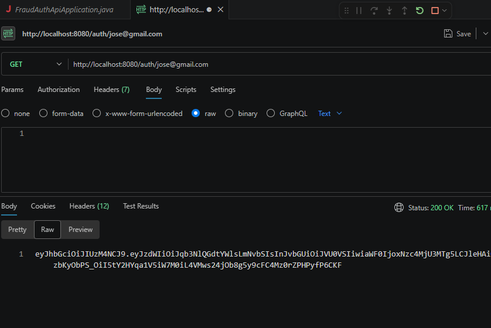
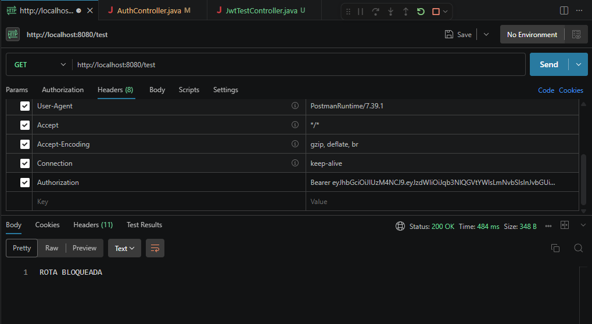

# 🔐 Fraud Detection Auth API

A secure authentication API built with **Spring Boot**, focused on fraud prevention, login protection, and stateless JWT authentication flows.

---

## 📋 Table of Contents

- [Features](#-features)
- [Technologies](#-technologies)
- [Project Structure](#-project-structure)
- [Security Architecture](#-security-architecture)
- [Authentication Flow](#-authentication-flow)
- [Fraud Prevention Logic](#-fraud-prevention-logic)
- [API Responses](#-api-responses)
- [Exception Handling](#-exception-handling)
- [Running the Project](#-running-the-project)
- [Author](#-author)

---

## ✅ Features

- User registration and authentication
- **JWT token generation and validation**
- **Stateless authentication (no server-side session)**
- **Spring Security filter chain configuration**
- **Route protection with JWT filter**
- **UserDetails integration for user loading**
- BCrypt password encryption
- Login attempt tracking
- Automatic user blocking after multiple failed attempts
- Suspicious IP detection
- DTO validation
- Global exception handling
- Layered architecture (Controller, Service, Repository, DTO, Security)
- PostgreSQL integration
- RESTful API design

---

## 🛠 Technologies

| Technology        | Version  | Purpose                            |
|-------------------|----------|------------------------------------|
| Java              | 21       | Core language                      |
| Spring Boot       | 3.x      | Application framework              |
| Spring Security   | 6.x      | Authentication & route protection  |
| Spring Data JPA   | 3.x      | Database abstraction layer         |
| JWT (jjwt)        | 0.12.x   | Token generation & validation      |
| PostgreSQL        | 15+      | Relational database                |
| BCrypt            | —        | Password hashing                   |
| Lombok            | —        | Boilerplate reduction              |
| Maven             | 3.x      | Build & dependency management      |

---

## 📁 Project Structure

```
src/main/java/com/fraud_auth_api
├── controller          # REST endpoints (AuthController, UserController)
├── dto                 # Request/Response data transfer objects
├── entity              # JPA entities (User, LoginAttempt)
├── enums               # UserStatus (ACTIVE, BLOCKED, UNDER_REVIEW)
├── exception           # GlobalExceptionHandler + custom exceptions
├── repository          # Spring Data JPA repositories
├── security
│   ├── filter          # JwtAuthenticationFilter
│   ├── config          # SecurityFilterChain configuration
│   ├── service         # UserDetailsServiceImpl
│   └── util            # JwtUtil (generate, validate, extract)
└── services            # Business logic (AuthService, FraudService)
```

---

## 🔒 Security Architecture

### JWT — Token Generation & Validation

JWT (JSON Web Token) is used to identify authenticated users in every request. After a successful login, the server generates a signed token returned to the client. On subsequent requests, the client sends this token in the `Authorization` header.

```
Authorization: Bearer <token>
```

The token contains:
- **Subject** → user's email or ID
- **Issued At** → token creation timestamp
- **Expiration** → token expiry timestamp
- **Signature** → HMAC-SHA256 signed with a secret key

---

### Spring Security — Filter Chain

Spring Security is configured to intercept all HTTP requests before they reach the controllers. The `SecurityFilterChain` bean defines:

- **Public routes** → `/auth/register`, `/auth/login` (no authentication required)
- **Protected routes** → all other endpoints require a valid JWT
- **Stateless session** → `SessionCreationPolicy.STATELESS` (no cookies or server sessions)
- **CSRF disabled** → appropriate for REST APIs with token-based auth

```java
http
    .csrf(csrf -> csrf.disable())
    .sessionManagement(session -> session
        .sessionCreationPolicy(SessionCreationPolicy.STATELESS))
    .authorizeHttpRequests(auth -> auth
        .requestMatchers("/auth/**").permitAll()
        .anyRequest().authenticated())
    .addFilterBefore(jwtFilter, UsernamePasswordAuthenticationFilter.class);
```

---

### JWT Authentication Filter

The `JwtAuthenticationFilter` extends `OncePerRequestFilter` and runs on every request. Its responsibilities:

1. Extract the JWT from the `Authorization` header
2. Validate the token signature and expiry
3. Load the user via `UserDetailsService`
4. Set the `SecurityContext` with the authenticated user

```java
String token = extractToken(request);
if (token != null && jwtUtil.isTokenValid(token)) {
    String email = jwtUtil.extractUsername(token);
    UserDetails user = userDetailsService.loadUserByUsername(email);
    // Sets authentication in SecurityContextHolder
}
```

---

### BCrypt — Password Hashing

Passwords are **never stored in plain text**. BCrypt applies a salt and a cost factor to produce a one-way hash. On login, `BCryptPasswordEncoder.matches()` compares the raw password against the stored hash.

```java
passwordEncoder.encode(rawPassword);      // on registration
passwordEncoder.matches(raw, encoded);    // on login
```

---

### UserDetails — User Loading

`UserDetailsServiceImpl` implements Spring Security's `UserDetailsService` interface. It loads users from the database by email/username and returns a `UserDetails` object used throughout the filter chain.

```java
@Override
public UserDetails loadUserByUsername(String email) throws UsernameNotFoundException {
    return userRepository.findByEmail(email)
        .orElseThrow(() -> new UsernameNotFoundException("User not found: " + email));
}
```

---

### Stateless Authentication

This API follows a **stateless** model — the server does not store any session state. Every request must carry a valid JWT. This design:

- Scales horizontally without session replication
- Is compatible with distributed/microservices environments
- Eliminates CSRF vulnerabilities tied to cookies

---

### Route Protection

Routes are divided into **public** and **protected**:

| Route              | Access         | Requires JWT |
|--------------------|----------------|--------------|
| `POST /auth/register` | Public      | ❌           |
| `POST /auth/login`    | Public      | ❌           |
| `GET /users/**`       | Protected   | ✅           |
| `GET /admin/**`       | Protected   | ✅           |

Accessing a protected route without a valid token returns `403 Forbidden`.

---

## 🔄 Authentication Flow

```
Client                        Server
  │                              │
  │  POST /auth/login            │
  │  { email, password }  ──────►│
  │                              │  1. Load user via UserDetailsService
  │                              │  2. Validate password with BCrypt
  │                              │  3. Check fraud rules (attempts, IP)
  │                              │  4. Generate JWT
  │◄────────────────────────     │
  │  { token: "eyJ..." }         │
  │                              │
  │  GET /users/profile          │
  │  Authorization: Bearer eyJ...│
  │  ───────────────────────────►│
  │                              │  5. JwtAuthenticationFilter runs
  │                              │  6. Token validated & user set in context
  │                              │  7. Controller processes request
  │◄─────────────────────────    │
  │  200 OK { user data }        │
```

---

## 🚨 Fraud Prevention Logic

The API includes protection mechanisms against suspicious authentication behavior.

### Implemented Rules

- User is **blocked after 5 failed login attempts**
- Login attempts are tracked with:
  - IP address
  - Timestamp
  - Success / failure status
- **Suspicious IP behavior detection**
- User status control:
  - `ACTIVE` → normal access
  - `BLOCKED` → access denied
  - `UNDER_REVIEW` → flagged for manual analysis

---

## 📸 API Responses

### ✅ Successful Register


---

### ✅ Successful Login


---

### 🔑 JWT Token Generation



---

### 🚫 Blocked Route (Missing / Invalid JWT)



---

### ⛔ User Blocked


---

### ❌ Validation Error


---

### ⚠️ Attempt Error


---

## ⚙️ Exception Handling

The project uses a global exception handler (`GlobalExceptionHandler`) with standardized API responses.

```json
{
  "timestamp": "2026-05-07T12:44:26",
  "status": 403,
  "error": "Access denied — invalid or missing JWT token",
  "path": "/users/profile"
}
```

```json
{
  "timestamp": "2026-05-07T12:44:26",
  "status": 400,
  "error": "email is required",
  "path": "/auth/login"
}
```

---

## 🚀 Running the Project

### 1. Clone the repository

```bash
git clone https://github.com/josemariadev12/fraud-detection-auth-api.git
cd fraud-detection-auth-api
```

### 2. Configure PostgreSQL

Update `src/main/resources/application.properties`:

```properties
spring.datasource.url=jdbc:postgresql://localhost:5432/fraud_auth_api
spring.datasource.username=your_user
spring.datasource.password=your_password
spring.jpa.hibernate.ddl-auto=update

# JWT
jwt.secret=your_secret_key_here
jwt.expiration=86400000
```

### 3. Run the application

```bash
./mvnw spring-boot:run
```

---

## 🗺️ Future Improvements

- [ ] Role-based authorization (ADMIN, USER)
- [ ] Refresh token support
- [ ] Rate limiting per IP
- [ ] Docker + Docker Compose support
- [ ] Unit and integration tests (JUnit 5 + Mockito)
- [ ] API documentation with Swagger / OpenAPI 3

---

## 👤 Author

Developed by **José Maria**.

[](https://github.com/josemariadev12)

---

> Built with ☕ Java, 🔐 Spring Security, and 🛡️ JWT — focused on security from the ground up.